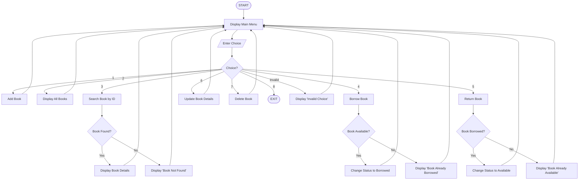

# E-Library Management System in C

A simple menu-driven E-Library Management System implemented in C to manage book records.

## Overview

This project is a console-based C program that allows users to manage books in a library. It provides options to add, display, search, borrow, return, update, and delete book records.

The project is designed to practice core C programming concepts using a practical real-world example.

## Features

- Add Book
- Display All Books
- Search Book by ID
- Borrow Book
- Return Book
- Update Book Details
- Delete Book
- Exit

## Book Information

Each book record contains:

- Book ID
- Book Title
- Author Name
- Publication Year
- Availability Status

## C Concepts Used

- Structures
- Arrays
- Loops
- Conditional Statements
- Strings
- Searching
- Record Management
- CRUD Operations

## How It Works

The program displays a menu and allows the user to select an operation.

```text
START
   ↓
Display Menu
   ↓
Choose Operation
   ↓
Add / Display / Search / Borrow / Return / Update / Delete
   ↓
Perform Operation
   ↓
Return to Menu
   ↓
Exit 
```

## E-Library Management System — Program Flowchart
 
This flowchart represents the complete logic of the C console program.
 

 
### Legend
 
| Symbol | Meaning |
|---|---|
| Oval | Start / End |
| Rectangle | Process (an action the program performs) |
| Diamond | Decision (branches based on a condition) |
| Arrow | Program flow / sequence |
 
## Author

Pooja Anbalagan

ECE Graduate
